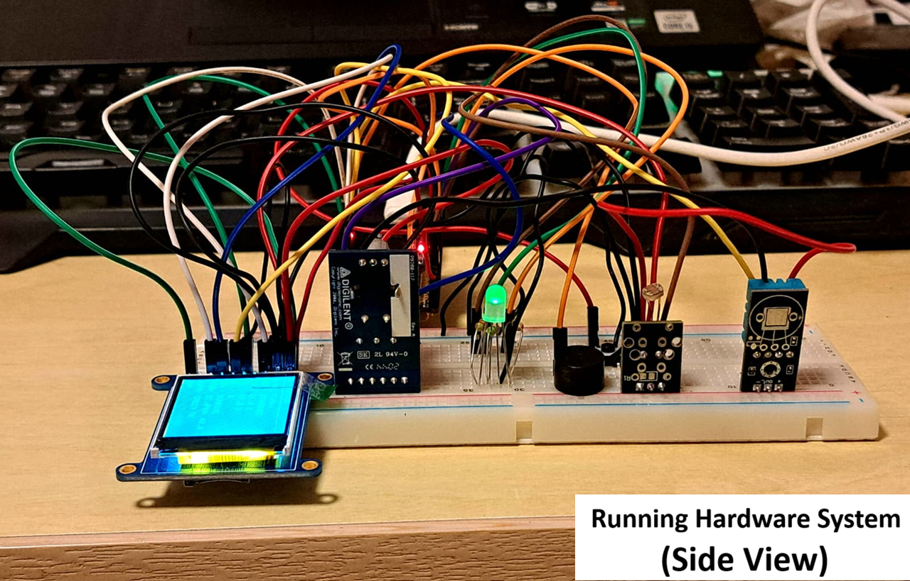
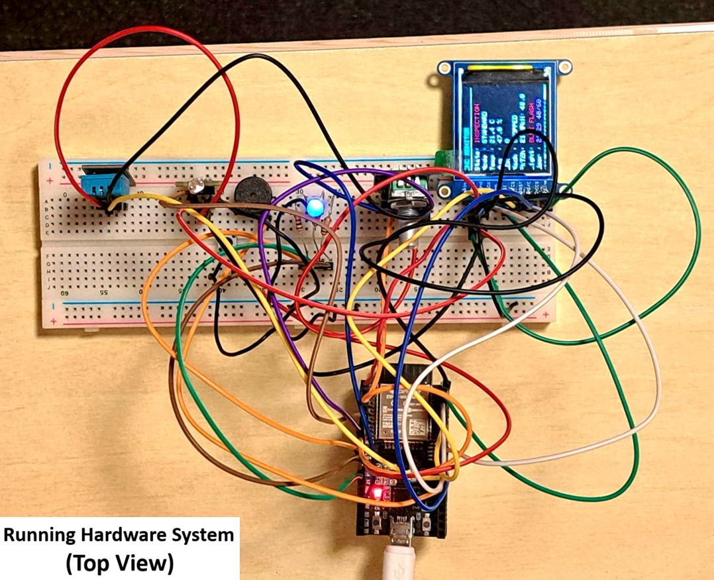

# ESP32 CNC Machine Monitoring Prototype

ESP32 and PlatformIO-based monitoring prototype for demonstrating environmental sensing, machine-condition indication, operator control, visual status reporting, audible alarms, and lockout/recovery behavior.

The project combines a DHT11 temperature/humidity sensor, LDR-based machine-state input, SPI TFT dashboard, rotary-encoder interface, RGB LED, buzzer, and push-button reset control.

> This is a prototype monitoring system for demonstration and embedded-systems development. It is not a production CNC safety controller and does not replace certified safety interlocks or industrial machine controls.



## Features

* ESP32 firmware developed with PlatformIO and the Arduino framework
* DHT11 temperature and humidity monitoring
* LDR-based light input used for machine-condition indication
* 128×128 SPI TFT dashboard for live system reporting
* Rotary encoder interface for mode selection and editable thresholds
* Three operating modes:

  * Standard
  * High-sensitivity
  * User-editable thresholds
* Four system states:

  * Normal
  * Unsafe
  * Inspection
  * Lockout
* RGB LED state indication
* Non-blocking buzzer alert patterns using ESP32 PWM tone generation
* Timed unsafe-condition tracking and lockout logic
* Five-second reset hold for lockout recovery
* Circular RAM logging of sensor and state information
* Two-hour peak temperature and humidity calculation
* Periodic serial status reporting for debugging

## Hardware

* ESP32 DevKit / ESP32-WROOM-32E
* DHT11 temperature and humidity sensor
* LDR photoresistor module
* 128×128 SPI TFT display
* Rotary encoder with push button
* Separate reset push button
* RGB LED
* Piezo buzzer
* Breadboard and jumper wires

## GPIO mapping

| Peripheral     | Signal            | ESP32 GPIO |
| -------------- | ----------------- | ---------: |
| DHT11          | Data              |         16 |
| LDR module     | Analogue output   |         34 |
| Rotary encoder | Channel A         |         32 |
| Rotary encoder | Channel B         |         33 |
| Rotary encoder | Push button       |         13 |
| Reset button   | Push button       |         27 |
| Buzzer         | PWM / tone output |          4 |
| RGB LED        | Red               |         25 |
| RGB LED        | Green             |         26 |
| RGB LED        | Blue              |         14 |
| TFT display    | SPI clock         |         18 |
| TFT display    | SPI MOSI          |         23 |
| TFT display    | Chip select       |         21 |
| TFT display    | Reset             |         17 |
| TFT display    | Data/command      |         22 |

## Operating behaviour

The firmware evaluates temperature and humidity against the currently active threshold set.

| State      | RGB LED behavior     | Audible behavior           |
| ---------- | -------------------- | -------------------------- |
| Normal     | Green                | Silent                     |
| Unsafe     | Red                  | Periodic warning pulse     |
| Inspection | Flashing blue        | Short double-chirp pattern |
| Lockout    | Alternating red/blue | Periodic lockout alert     |

The system tracks unsafe operation over time. Repeated or prolonged unsafe conditions can trigger lockout, which requires the reset button to be held for approximately five seconds before recovery.

## User interaction

The rotary encoder provides the main local interface:

* Rotate encoder: cycle modes or adjust the selected threshold
* Encoder button: enter and move through editable threshold fields
* Reset button: recover from lockout after the required hold period

## Software dependencies

PlatformIO installs the dependencies listed in `platformio.ini`:

* Adafruit DHT sensor library
* Adafruit Unified Sensor
* Adafruit GFX Library
* Adafruit ST7735 and ST7789 Library

## Build and upload

1. Install [PlatformIO](https://platformio.org/) in Visual Studio Code.
2. Open this repository folder as a PlatformIO project.
3. Connect the ESP32 board by USB.
4. Select the correct serial port in PlatformIO.
5. Build and upload the firmware.
6. Open the serial monitor at `115200` baud.

## Repository structure

```text
cnc-machine-monitoring-system/
├── platformio.ini
├── src/
│   └── main.cpp
├── assets/
│   ├── hardware-prototype-side-view.png
│   └── hardware-prototype-top-view.png
└── README.md
```

## Prototype evidence

### Side view


### Top view



## Future improvements

* Replace the DHT11 with an industrial-grade temperature and humidity sensor.
* Use a vibration, current, or Hall-effect sensor for more direct machine activity detection.
* Add non-volatile logging to SD card or external flash.
* Add wireless telemetry through Wi-Fi or MQTT.
* Develop a compact PCB version of the prototype.
* Introduce safety-rated hardware and certified interlock mechanisms for any real industrial deployment.

## Scope

This repository contains the firmware and prototype evidence for the embedded monitoring system. It does not contain coursework reports, assessment materials, or documentation not authored for this public repository.
